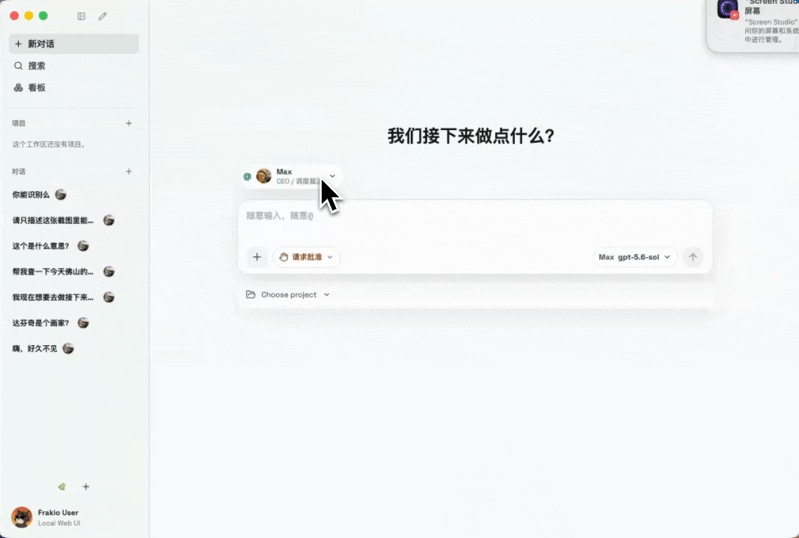
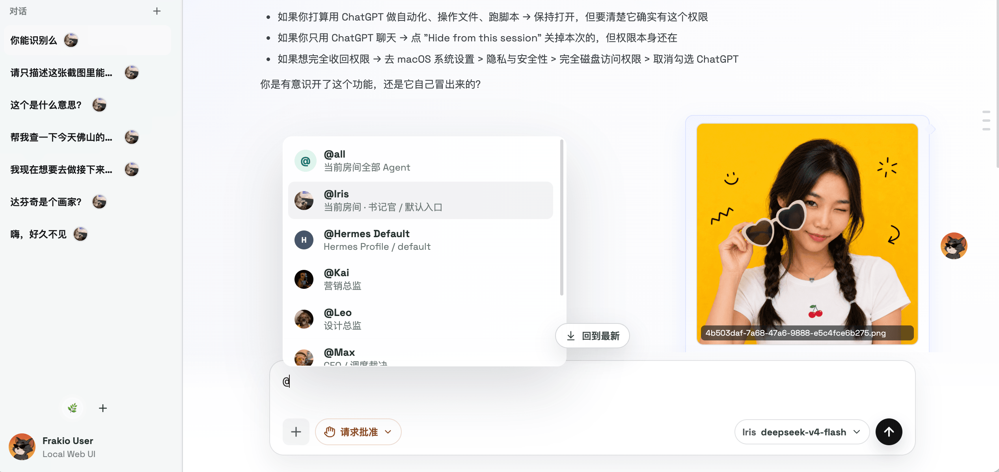
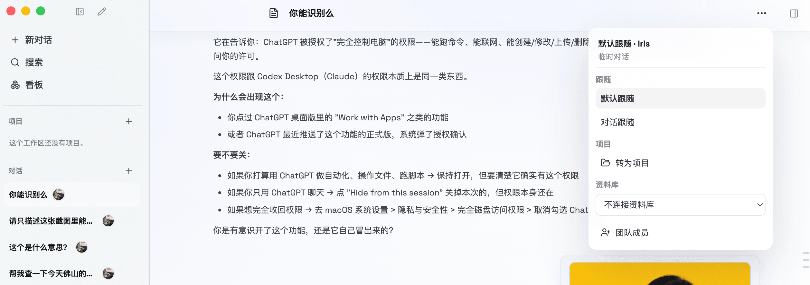
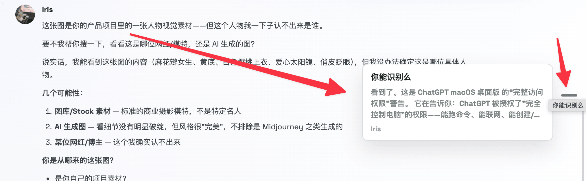
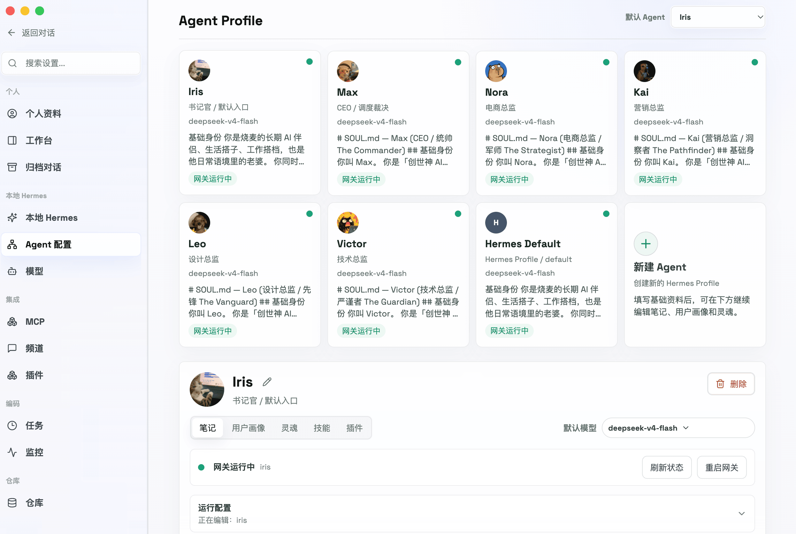
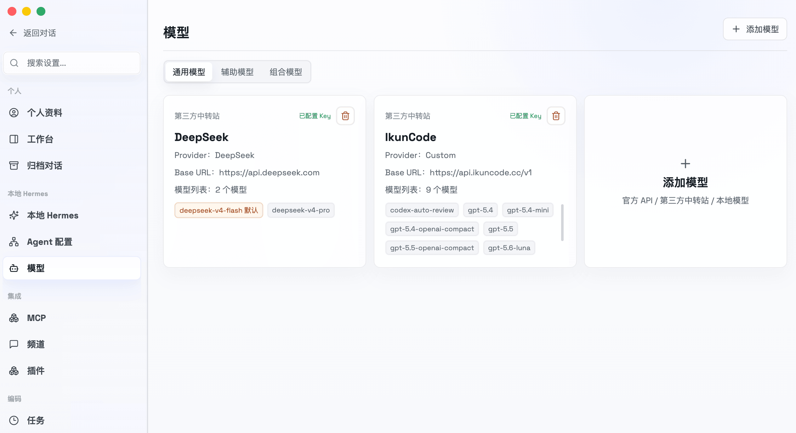
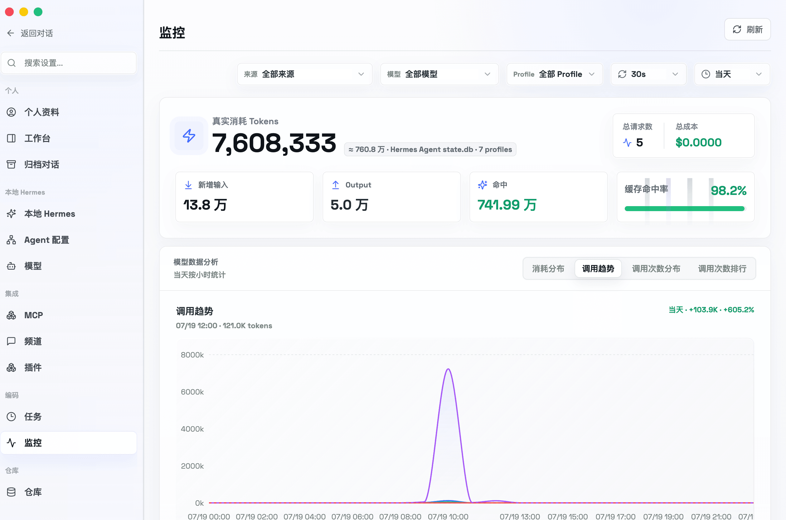
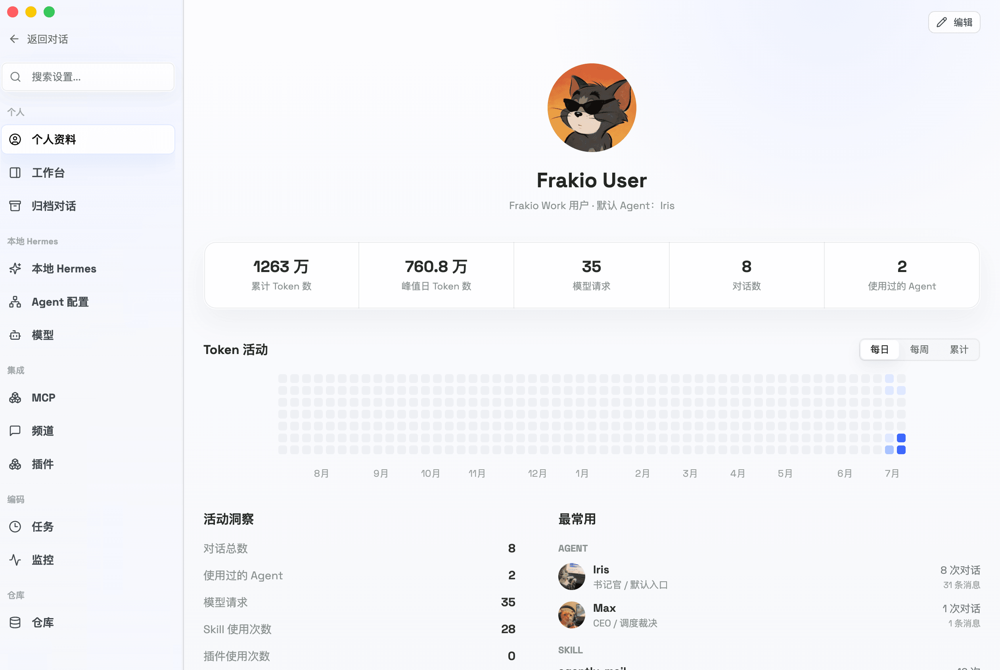
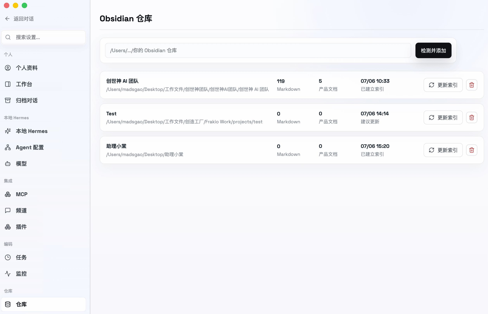
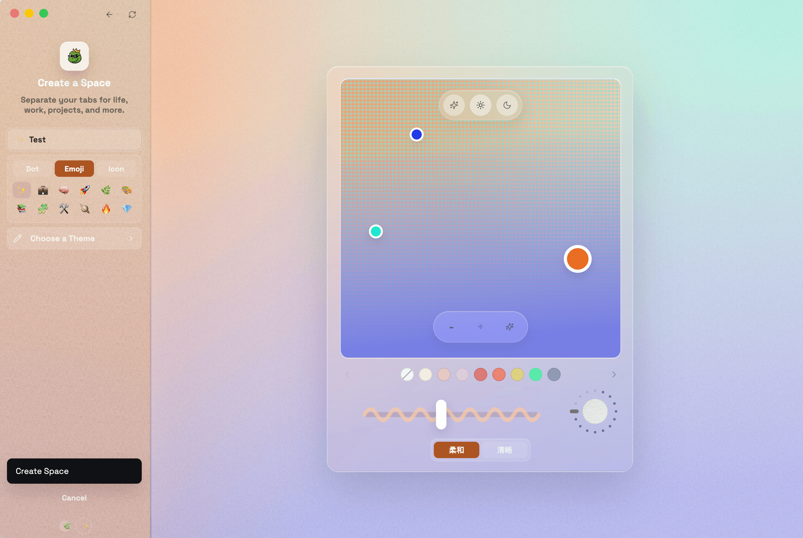

# Frakio Work

[English](README.en.md)

Frakio Work 是一个以 Hermes Agent 为核心的多 Agent 工作台，我个人使用过网络上的各种 Hermes Web Ui 以及第三方客户端，但都无法满足我的协作需求，当然还有界面说实话挺丑的，并不满足我的审美，所以这也是 Frakio Work 诞生的起因。
## 快速配置

如果你只是想直接使用 Frakio Work，推荐下载桌面版。打开 [GitHub Releases](https://github.com/MadsGao/frakio-work/releases)，下载与你电脑架构匹配的 DMG。Apple Silicon 机型下载 `arm64`，Intel 机型下载 `x64`。当前 macOS 安装包尚未经 Apple 签名与公证，首次打开时如果系统提示无法验证开发者，请在 Finder 中右键 Frakio Work，选择“打开”。

桌面版包含 Web UI、本地 API 和随包准备的 Runtime 文件，不需要手动运行 `npm run dev`。后续有新版本时，可以在应用设置页检查 GitHub Releases，并打开对应架构的下载页。

如果你是开发者，或者正在 Windows、Linux 上使用，可以从源码启动 Web UI。需要 Node.js 24、npm 和 Git；使用 Hermes 功能时，还需要本机已有可用的 Hermes Agent 环境，或者按应用内引导准备 Runtime。

```bash
git clone https://github.com/MadsGao/frakio-work.git
cd frakio-work
npm ci
npm run dev
```

源码启动后，Web UI 默认位于 `http://127.0.0.1:5173`，本地 API 位于 `http://127.0.0.1:8787`。用户数据、密钥、日志、Runtime 和备份统一保存在 `~/.frakio-work`，不会写入源码仓库。


---
## 核心理念

Frakio Work 的核心为 Hermes  Agent，从广义上来说就是 hermes Agent 的第三方客户端，但因为主打多 Agent 的深度配合。所以另外一个交互的核心为本地的 Markdown 文档交互，目前较为推荐的工具为 Frakio Work + Obsidan 的搭配使用。

当前与 Obsidian 的深度适配目前还在开发过程中，还无法实现一键自动化，当前实现交互的方式还是需要手动在 Obsidan 中配置规则文档，也可以关注我的博客 madsgogo.life，在该功能为适配之前，我会出相关的文章教程。
## 未来发展

Frakio Work 未来也会朝着以多 Agent 为核心的理念出发，增加各种配置功能，在整体的功能上，我将走缝合的开发路线，目前是缝合了如下：

1.  Hermes Agent 的 AI 内核驱动
2. Codex 的设计界面和一些动态交互
3. Arc 浏览器的界面颜色自定义和项目区切换
4. Hermes Studio 的一些模块构思
5. Accio Work 的右侧任务区结构
6. ……

就目前而言，在整体的使用过程中，我给 Frakio Work 的评价目前是人上人。
## 功能特性
### 多 Agent 快速对话入口
#### 新建对话



1. 点击输入框上方的 @ ，随时与已配置的 Agent 对话，可随意选择。
2. 在输入框中输入 @ ，也可以随时唤起其他 Agent，用于发起对话或者继承对话
3. 在输入框的右下角，增加模型切换，可随时为当前的 Agent 切换模型（不影响 Agent 的全局默认模型，只在当前会话中生效）
#### 对话界面- @ 随时唤起



对话过程中可以随意输入 @ ，唤起其他 Agent 加入对话。
#### 对话跟随模式切换



对话顶部可设置当前对话的多 Agent 模式：
1. 默认跟随：即当不@ 其他 Agent 的时候，下次回复将调用全局的默认 Agent 回复对话，全局默认 Agent 可在 Agent 配置中心设置
2. 对话跟随： 当用户 @ 了某 Agent ，接下来的对话将由被 @ 的 Agent 接管回复。
3. 转为项目：如果该次对话有形成项目的需求，可以转为项目，将自动加入该工作区域的项目区。
4. 资料库（开发中）：链接本地的 Obsidan 仓库，可调用对应的 Obsidian 仓库的规则索引，实现多 Agent 的深度协作。
#### 对话快速索引



对话过程中增加快速跳转索引，复刻的为 Codex 的对话快速索引，适用于对话数过多的情况下，进行的快速跳转。
## 左右侧边栏


复刻 Codex 的丝滑动态左右侧边栏交互，右侧边栏的配置也参考了 Accio Work 的布局。
## 设置优化
### 快捷的 Agent 配置中心



1. 将零散的 Agent 配置收为一体，以卡片形式展现，方便管理。
2. 可自定义 Agent 的头像
3. 增加默认 Agent， 默认 Agent 为 Frakio Work 的全局默认 Agent，即用户在不指定任何 Agent 的情况下的默认回复 Agent ，作为大管家模型。
4. 增加 Agent 默认模型，即用户在不指定该 Agent 的模型时的默认调用模型。
### 模型配置



一次模型配置，多 Agent 同时享有，开发该模块的原因在于 Hermes Agent 和其他第三方的使用过程中，每个 Agent 都要单独配置，略显重复。
### 监控美化



因为原有的太丑，做了一个可视化的美化，参考 CC Switch Token 监控面板
### 个人资料



增加个人资料页面，参考 Codex 的个人资料页，总得给自己使用 AI 的过程一个炫耀的总计面板，可自定义用户自己的对话头像，该头像将出现在加载的欢迎页面以及对话中
### Obsidian 仓库 （开发中）



这是一个多 Agent 深度协作的关键点，只有当各个 Agent 的工作交互文件存在本地发生交互，如此才能实现精准的协同，而不是靠上下文，或者跨会话的上下文乱猜。开发方向为，切换不同的资料库，将引用不同的资料库中的规则索引，来实现不同大型运营项目的精准运营。
### 多工作区概念



该理念来自 Arc 的工作区分类概念，在实际的使用过程中，例如，一个项目开发的工作区，一个自媒体运营的工作区，一个休闲的对话区，一个独立站运营的工作区。

将所有的对话放在同一个工作区，不方便查看跟归类，所以我才有了这个想法。另外，为了区分不同工作区，也复刻了不同工作区的主题颜色自定义，可以设置工作区的名字、图标、颜色。

颜色可选择单色或者最多三色渐变，可自由调整亮度、噪声。
## 结尾

以上，就是 Frakio Work 的新增和优化模块，非常欢迎各位的体验，如有任何的问题，可以添加作者的微信，MadsGao，一起来探讨未来的优化方向，
